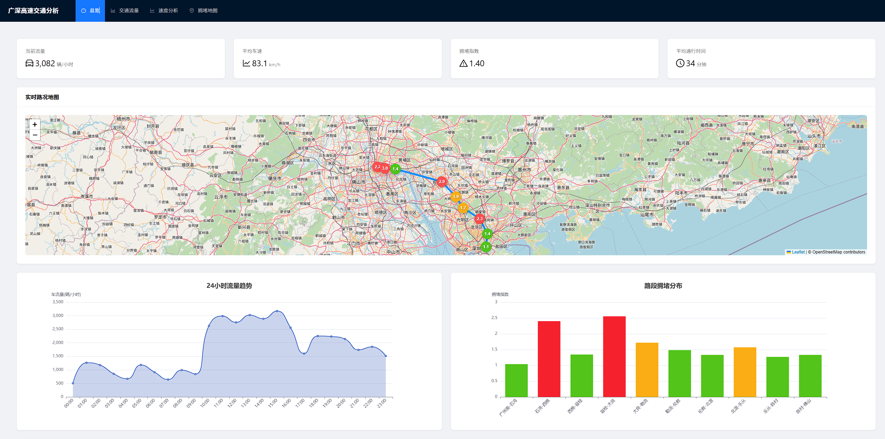

# 广州-广深高速公路交通数据可视化系统 🚗

一个现代化的交通数据可视化平台，用于实时监控和分析广州-广深高速公路的交通状况。


### 项目截屏


## 功能特点 ✨

- 📊 实时交通数据展示
  - 车流量统计
  - 平均车速监测
  - 拥堵指数分析
  - 通行时间计算

- 🗺️ 多维度数据可视化
  - 交通流量趋势图
  - 速度分布热力图
  - 路网拥堵状态图
  - 车型构成分析
  - OpenStreetMap 实时路况地图
  - 路段拥堵状态标记
  - 路线动态展示

- ⚡ 实时数据更新
  - 5秒自动刷新
  - 多时间维度查看
  - 多路段数据对比
  - 实时路况更新

- 🎯 智能分析功能
  - 交通流量预测
  - 拥堵预警提示
  - 路段状态评估
  - 事故信息追踪
  - 路段拥堵趋势分析

## 技术栈 🛠️

- **前端框架**
  - React 18.2.0
  - TypeScript 4.9.5
  - React Router v6.22.1

- **UI 组件**
  - Ant Design 5.24.1
  - ECharts 5.6.0
  - Leaflet 1.9.4
  - echarts-for-react 3.0.2

- **开发工具**
  - Create React App 5.0.1
  - Node.js >= 14.0.0
  - npm >= 6.14.0

- **依赖管理**
  - @types/react 18.2.55
  - @types/react-dom 18.2.19
  - @types/leaflet 1.9.16
  - axios 1.7.9
  - lodash 4.17.21

## 环境要求 🔧

- Node.js >= 14.0.0
- npm >= 6.14.0
- 现代浏览器（Chrome, Firefox, Safari, Edge 等）
- 屏幕分辨率建议 >= 1920x1080

## 快速开始 🚀

1. **进入项目**
   
   ```bash
   cd gz-gsz-highway-new
   ```

2. **安装依赖**
   ```bash
   npm install
   ```

3. **启动开发服务器**
   ```bash
   npm start
   ```

4. **构建生产版本**
   ```bash
   npm run build
   ```

## 项目结构 📁

```
src/
├── components/        # 通用组件
│   ├── layout/       # 布局组件
│   ├── charts/       # 图表组件
│   ├── map/          # 地图组件
│   └── common/       # 公共组件
├── pages/            # 页面组件
├── services/         # 数据服务
├── utils/            # 工具函数
├── types/            # 类型定义
├── assets/           # 静态资源
└── styles/           # 样式文件
```

## 主要功能模块 🔍

### 1. 总览面板
- 关键指标实时展示
- 24小时流量趋势
- 路段拥堵分布
- 实时事故信息
- 实时路况地图展示
- 路段状态动态更新

### 2. 交通流量分析
- 流量趋势图表
- 车型分布统计
- 历史数据对比
- 流量预测分析

### 3. 速度分析
- 路段速度分布
- 速度变化热力图
- 速度对比分析
- 异常情况标记

### 4. 拥堵地图
- 实时拥堵展示
- 路网状态可视化
- 拥堵趋势分析
- 拥堵预警提示
- 路段实时状态标记
- 交互式地图操作

## 更新日志 📝

### v0.1.2 (2024-02-18)
- 📝 更新技术栈版本信息
- ⚙️ 添加环境要求说明
- 🔍 完善项目依赖文档

### v0.1.1 (2024-02-18)
- 🗺️ 新增 OpenStreetMap 地图功能
- 🎯 添加实时路况可视化
- 🔄 实现路段状态动态更新
- 💡 优化用户交互体验

### v0.1.0 (2024-02-18)
- 🎉 项目初始化
- ✨ 实现基础功能
- 🔧 完成核心模块
- 📊 添加数据可视化
